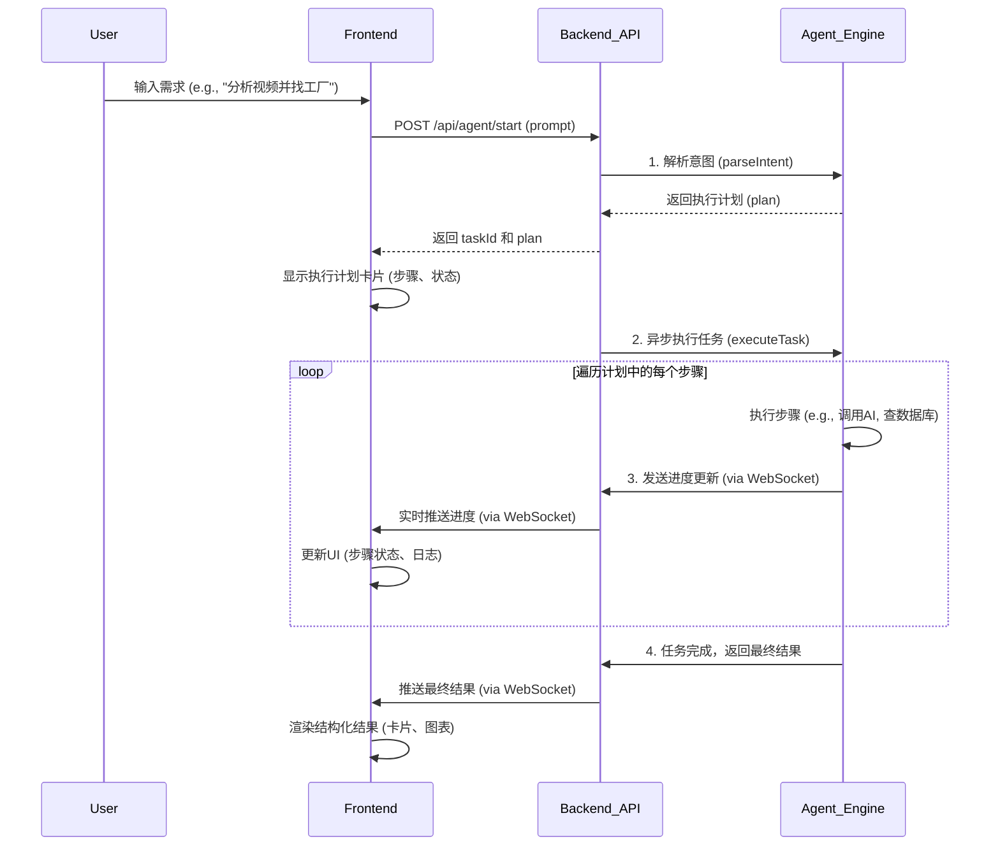

# Demand-OS: 对标 Accio 的完整架构方案

**版本**: 2.0  
**日期**: 2026-02-07  
**作者**: Manus AI  
**目标**: 实现一个真正对标 Accio 的对话式执行引擎，支持智能意图理解、动态步骤生成、实时进度展示和结构化结果呈现。

---

## 1. 总体架构

系统将分为三个核心部分：**前端 (Next.js)**、**后端 (Next.js API Routes)** 和 **AI 引擎 (Agent Engine)**。交互流程如下：



---

## 2. AI 引擎 (Agent Engine) 设计

这是系统的核心，负责将用户的自然语言需求转化为可执行的任务。

### 2.1 Agent (任务模板)

我们将预定义一系列 `Agent`，每个 `Agent` 代表一个可执行的复杂任务模板。

```typescript
// file: lib/agents/index.ts

// 定义 Agent 的结构
export interface Agent {
  id: string;
  name: string;
  description: string;
  triggers: string[]; // 触发关键词
  planner: (prompt: string) => Promise<Step[]>; // 任务规划器
}

// 定义 Step 的结构
export interface Step {
  id: string;
  name: string;
  action: (context: any) => Promise<any>; // 具体执行的函数
  // UI 相关
  status: 'pending' | 'running' | 'completed' | 'failed';
  log: string[];
  result?: any;
}
```

### 2.2 意图理解器 (Intent Parser)

- **输入**: 用户的原始 prompt (e.g., "帮我分析这个视频并找工厂")。
- **逻辑**: 使用 LLM (GPT-4.1-mini) 和关键词匹配，从所有 `Agent` 中选择最匹配的一个。
- **输出**: 匹配到的 `Agent` ID。

```typescript
// file: lib/agent-engine/intent-parser.ts
import { allAgents } from '@/lib/agents';

export async function parseIntent(prompt: string): Promise<string | null> {
  // 1. 关键词匹配 (快速路径)
  for (const agent of allAgents) {
    if (agent.triggers.some(trigger => prompt.includes(trigger))) {
      return agent.id;
    }
  }

  // 2. LLM 意图识别 (慢速但更智能)
  // ... 调用 LLM 判断用户意图最符合哪个 Agent 的 description
  return 'viral-tracker-agent'; // 示例返回
}
```

### 2.3 任务规划器 (Task Planner)

- **输入**: 用户的 prompt 和匹配到的 `Agent`。
- **逻辑**: 每个 `Agent` 内部的 `planner` 函数负责生成执行计划。它会调用 LLM，根据 prompt 动态生成步骤列表。
- **输出**: 一个 `Step[]` 数组，即执行计划。

```typescript
// file: lib/agents/viral-tracker-agent.ts

export const viralTrackerAgent: Agent = {
  id: 'viral-tracker-agent',
  name: '爆款追踪助手',
  description: '分析 TikTok 视频，评估产品潜力，并匹配供应商。',
  triggers: ['分析视频', '找工厂', 'TikTok'],
  planner: async (prompt: string): Promise<Step[]> => {
    // 调用 LLM，根据 prompt 生成具体的步骤
    // 例如，如果 prompt 只说“分析视频”，就只生成分析相关的步骤
    // 如果 prompt 还说“找工厂”，就额外生成匹配工厂的步骤
    return [
      { id: 'step1', name: '分析视频内容', action: analyzeVideo, ... },
      { id: 'step2', name: '评估市场潜力', action: assessMarket, ... },
      { id: 'step3', name: '匹配供应商', action: findSuppliers, ... },
    ];
  },
};
```

### 2.4 任务执行引擎 (Task Executor)

- **输入**: `taskId` 和 `Step[]` (执行计划)。
- **逻辑**: 遍历执行计划，按顺序执行每个 `Step` 的 `action` 函数。通过 WebSocket 实时广播进度。
- **输出**: 实时进度更新和最终的聚合结果。

---

## 3. 后端 API 设计

### `POST /api/agent/start`

- **功能**: 启动一个新任务。
- **请求体**: `{ "prompt": "..." }`
- **逻辑**:
  1. 调用 `IntentParser` 找到合适的 `Agent`。
  2. 调用该 `Agent` 的 `TaskPlanner` 生成执行计划。
  3. 创建一个 `taskId`，将任务信息存入数据库/缓存。
  4. **立即返回** `{ taskId, plan }`。
  5. **异步**调用 `TaskExecutor` 开始执行任务。

### WebSocket 通信

- **连接**: 前端在收到 `taskId` 后，建立一个 WebSocket 连接到 `/api/ws?taskId={taskId}`。
- **消息格式**:
  - **进度更新**: `{ "type": "progress", "stepId": "...", "status": "...", "log": "..." }`
  - **最终结果**: `{ "type": "result", "data": { ... } }`

---

## 4. 前端设计

### 4.1 核心组件

1. **`ChatInterface`**: 主聊天界面，包含消息历史和输入框。
2. **`ExecutionPlanCard`**: 用于展示 AI 生成的执行计划。接收 `Step[]` 作为 props，并根据 WebSocket 消息实时更新每个步骤的状态。
3. **`ResultRenderer`**: 根据结果类型动态渲染不同的组件。
   - `result.type === 'product_analysis'` -> `<ProductAnalysisCard />`
   - `result.type === 'supplier_list'` -> `<SupplierList />`

### 4.2 页面流程 (`/chat`)

1. **初始状态**: 显示欢迎语和输入框。
2. **用户输入**: 用户输入 prompt 并发送。
3. **发送请求**: 调用 `POST /api/agent/start`。
4. **显示计划**: 收到响应后，在消息流中渲染 `ExecutionPlanCard` 组件，并建立 WebSocket 连接。
5. **实时更新**: 监听 WebSocket 消息，实时更新 `ExecutionPlanCard` 中的步骤状态和日志。
6. **显示结果**: 收到 `result` 消息后，在消息流中渲染 `ResultRenderer` 组件。

---

## 5. 数据模型

### `Task` (存储在 Redis 或数据库中)

```json
{
  "taskId": "task-12345",
  "prompt": "分析这个视频...",
  "status": "running", // pending, running, completed, failed
  "plan": [
    { "id": "step1", "name": "分析视频", "status": "completed", ... },
    { "id": 'step2', "name": "评估市场", "status": "running", ... }
  ],
  "results": {},
  "createdAt": "..."
}
```

---

## 6. 实施计划 (P0 核心功能)

| 阶段 | 核心任务 | 涉及文件 | 预计时间 |
| :--- | :--- | :--- | :--- |
| **1. 架构设计** | - 编写本文档，明确所有组件和流程。 | `docs/ACCIO_ALIGNED_ARCHITECTURE.md` | 1 天 |
| **2. 后端实现** | - 定义 `Agent` 和 `Step` 结构。<br>- 创建 `viral-tracker-agent` 模板。<br>- 实现 `IntentParser` 和 `TaskPlanner`。<br>- 创建 `/api/agent/start` API。<br>- 实现 WebSocket 后端逻辑。 | `lib/agents/*`<br>`lib/agent-engine/*`<br>`app/api/agent/start/route.ts`<br>`app/api/ws/route.ts` | 3-4 天 |
| **3. 前端开发** | - 重构 `/chat` 页面。<br>- 创建 `ExecutionPlanCard` 组件。<br>- 创建 `ProductAnalysisCard` 和 `SupplierList` 结果组件。<br>- 实现 WebSocket 客户端逻辑。 | `app/chat/page.tsx`<br>`components/agent/*` | 3-4 天 |
| **4. 整合测试** | - 端到端测试完整的对话流程。<br>- 优化 UI 交互和加载状态。 | - | 2 天 |

**总计**: 约 9-11 天。
