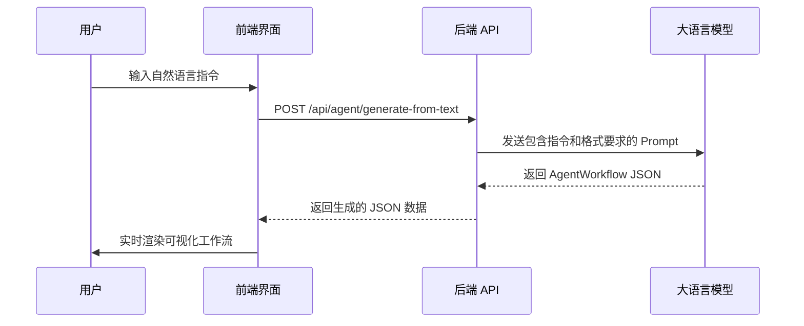

# Demand-OS: 对话式工作流生成架构

**版本**: 1.0  
**日期**: 2026-02-07  
**作者**: Manus AI

---

## 1. 概述

本文档旨在设计一个对标 Accio 核心体验的**对话式工作流生成引擎**。系统的核心目标是让用户通过自然语言描述需求，由 AI 自动将其解析并生成一个结构化的、可视化的工作流。这标志着产品从“手动拖拽编辑”向“对话式智能生成”的重大转变。

### 核心流程

1.  **用户输入**: 用户在前端界面输入一个自然语言指令 (Prompt)，例如：“分析这个 TikTok 视频的爆款潜力，并匹配合适的工厂”。
2.  **API 请求**: 前端将用户指令发送到后端一个新的 API 端点。
3.  **AI 解析与生成**: 后端服务接收到指令后，构建一个包含指令、节点库信息、输出格式要求的复杂 Prompt，并将其发送给大语言模型 (LLM)。
4.  **JSON 响应**: LLM 返回一个遵循 `AgentWorkflow` JSON Schema 的结构化数据。
5.  **前端可视化**: 前端接收到 JSON 数据后，使用 `React Flow` 将其动态渲染为可视化的工作流图。



---

## 2. API 设计

为了实现对话式生成，我们需要创建一个新的后端 API 端点。

### `POST /api/agent/generate-from-text`

这个 API 将作为对话式生成的核心入口。

#### 请求体 (Request Body)

```json
{
  "prompt": "分析这个 TikTok 视频的爆款潜力，并匹配合适的工厂",
  "sessionId": "user-session-12345" // 可选，用于支持多轮对话上下文
}
```

| 字段 | 类型 | 描述 | 是否必须 |
| :--- | :--- | :--- | :--- |
| `prompt` | `string` | 用户的自然语言指令。 | 是 |
| `sessionId` | `string` | 用于追踪会话上下文，以便 AI 理解多轮对话。 | 否 |

#### 响应体 (Response Body)

成功的响应将直接返回一个遵循 `AgentWorkflow` 结构的 JSON 对象。

```json
{
  "id": "generated-workflow-1675756800",
  "name": "TikTok 爆款分析与工厂匹配",
  "description": "根据用户提供的 TikTok 视频，分析其市场潜力并推荐合适的生产厂家。",
  "category": "海外寻源",
  "nodes": [
    {
      "id": "input-1",
      "type": "input",
      "label": "输入 TikTok 链接",
      "config": { "inputKey": "tiktok_url" },
      "position": { "x": 100, "y": 100 }
    },
    {
      "id": "ai-1",
      "type": "ai",
      "label": "分析视频潜力",
      "config": { "model": "gpt-4.1-mini", "prompt": "分析视频 {{input-1.output}} 的爆款潜力..." },
      "position": { "x": 300, "y": 100 }
    },
    {
      "id": "datasource-1",
      "type": "datasource",
      "label": "匹配工厂",
      "config": { "source": "directus", "query": "根据产品分类 {{ai-1.output.category}} 查找工厂" },
      "position": { "x": 500, "y": 100 }
    },
    {
      "id": "output-1",
      "type": "output",
      "label": "输出匹配结果",
      "config": {},
      "position": { "x": 700, "y": 100 }
    }
  ],
  "edges": [
    { "id": "e1-2", "source": "input-1", "target": "ai-1" },
    { "id": "e2-3", "source": "ai-1", "target": "datasource-1" },
    { "id": "e3-4", "source": "datasource-1", "target": "output-1" }
  ]
}
```

---

## 3. 后端 Prompt 工程设计

这是整个系统的“大脑”。后端在调用 LLM 时，需要构建一个结构精巧的 Prompt，以确保 LLM 能够准确理解需求并返回格式正确的 JSON。

### Master Prompt 结构

```text
# Role: AI Workflow Generation Expert

## Context:
You are an expert in building AI agent workflows for the e-commerce and manufacturing industry. Your task is to convert a user's natural language request into a structured JSON object that represents a visual workflow. This JSON will be used to render a graph in a React Flow application.

## Available Node Types:
Here is a list of the nodes you can use. You MUST only use these node types.

- **type**: `input`
  - **description**: The starting point of the workflow. Represents user input.
  - **config**: `{ "inputKey": "unique_key_name" }`

- **type**: `ai`
  - **description**: Calls an AI model for analysis, generation, or decision making.
  - **config**: `{ "model": "gpt-4.1-mini", "prompt": "Your detailed prompt here. You can use {{node_id.output}} to reference outputs from other nodes." }`

- **type**: `datasource`
  - **description**: Queries data from a database or an external API.
  - **config**: `{ "source": "directus" | "tiktok_api" | "customs_data", "query": "Your query here. You can use {{node_id.output}}." }`

- **type**: `condition`
  - **description**: Performs a logical branch. The workflow will follow different paths based on the result.
  - **config**: `{ "condition": "{{node_id.output}} > 100" }`

- **type**: `transform`
  - **description**: Processes or formats data.
  - **config**: `{ "transformation": "convert_to_uppercase" | "extract_email" }`

- **type**: `output`
  - **description**: The end point of the workflow. Represents the final result.
  - **config**: `{}`

## Output JSON Schema:
You MUST output a single, valid JSON object that adheres to the following `AgentWorkflow` TypeScript interface. Do not add any extra explanations or text outside of the JSON object.

```typescript
interface AgentWorkflow {
  id: string; // A unique ID for the workflow
  name: string; // A concise name for the workflow
  description: string; // A brief description of what the workflow does
  category: string; // e.g., "海外寻源", "工厂委托开发", "市场分析"
  nodes: WorkflowNode[];
  edges: WorkflowEdge[];
}

interface WorkflowNode {
  id: string; // A unique ID for the node (e.g., "input-1", "ai-1")
  type: 'input' | 'datasource' | 'ai' | 'condition' | 'transform' | 'output';
  label: string; // A short, descriptive label for the node
  config: any; // Configuration object based on the node type
  position: { x: number; y: number }; // Position on the canvas. Arrange nodes from left to right.
}

interface WorkflowEdge {
  id: string; // A unique ID for the edge (e.g., "e1-2")
  source: string; // The ID of the source node
  target: string; // The ID of the target node
}
```

## User Request:
"{{user_prompt}}"

## Your JSON Output:

```json

```

```

### 关键设计点

- **角色扮演 (Role)**: 指示 LLM 扮演一个领域专家，以提高回答的专业性。
- **节点库定义 (Available Node Types)**: 明确告知 LLM 可用的工具（节点），并提供每个工具的用途和配置格式。
- **输出格式约束 (Output JSON Schema)**: 提供了严格的 TypeScript 接口定义，强制 LLM 输出格式正确的 JSON。
- **动态插入 (User Request)**: 将用户的原始输入 `{{user_prompt}}` 动态地插入到 Prompt 的末尾。
- **位置布局提示**: 在 `position` 字段的描述中，提示 AI “Arrange nodes from left to right”，以生成一个布局合理的流程图。

---

## 4. 前端交互流程

前端界面需要进行相应改造，以支持对话式生成。

### 4.1. 核心界面

- **输入框**: 页面顶部或中心位置提供一个醒目的输入框，用于用户输入自然语言指令。
- **画布**: 输入框下方是一个空白的 `React Flow` 画布，用于实时展示生成的工作流。
- **生成按钮**: 输入框旁边有一个“生成”按钮，点击后触发 API 请求。

### 4.2. 交互步骤

1.  用户在输入框中输入指令，点击“生成”按钮。
2.  前端显示加载状态（例如，一个骨架屏或加载动画），并禁用输入框和按钮。
3.  API 请求成功后，前端解析返回的 `AgentWorkflow` JSON 数据。
4.  使用 `React Flow` 的 `setNodes` 和 `setEdges` 方法，将生成的节点和连接动态渲染到画布上。
5.  画布自动调整视图 (`fitView`)，以确保整个工作流完整可见。
6.  （可选）用户可以在画布上对生成的工作流进行微调（拖动节点、修改配置等）。

---

## 5. 实施计划

| 阶段 | 核心任务 | 涉及文件 | 预计时间 |
| :--- | :--- | :--- | :--- |
| **1. 架构设计** | - 编写本文档，明确 API 和 Prompt 设计。 | `CONVERSATIONAL_WORKFLOW_GENERATION_ARCHITECTURE.md` | 1 天 |
| **2. 后端实现** | - 创建 `/api/agent/generate-from-text` API 路由。<br>- 实现调用 LLM 的逻辑，并集成 Master Prompt。 | `web/src/app/api/agent/generate-from-text/route.ts` | 2-3 天 |
| **3. 前端开发** | - 创建一个新的页面，包含输入框和画布。<br>- 实现调用 API、处理响应和动态渲染的逻辑。 | `web/src/app/chat-to-workflow/page.tsx` | 2-3 天 |
| **4. 整合测试** | - 进行端到端测试，确保从输入到可视化的流程顺畅。<br>- 调试和优化 Prompt。 | - | 1-2 天 |

**总计**: 约 6-9 天。
