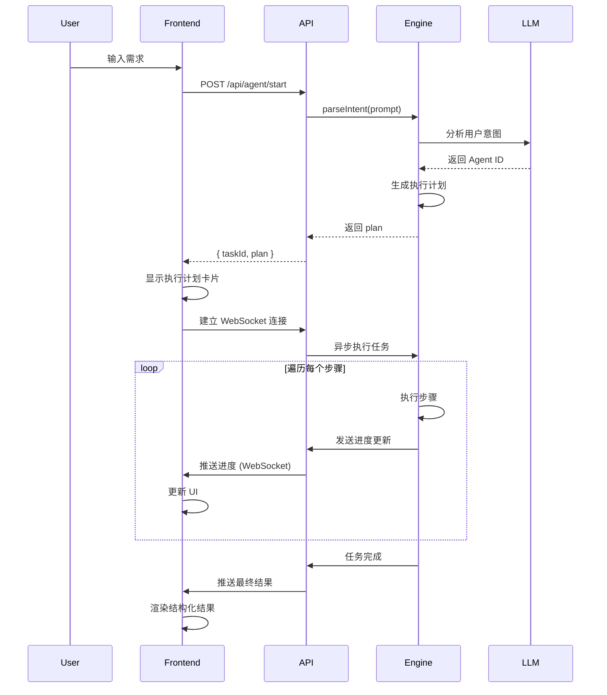

# Demand-OS: 对标 Accio 的完整架构方案

**版本**: 2.0  
**日期**: 2026-02-07  
**作者**: Manus AI  
**目标**: 实现一个真正对标 Accio 的对话式执行引擎

---

## 📋 目录

1. [执行摘要](#1-执行摘要)
2. [Accio 核心特性分析](#2-accio-核心特性分析)
3. [系统总体架构](#3-系统总体架构)
4. [AI 引擎设计](#4-ai-引擎设计)
5. [后端 API 设计](#5-后端-api-设计)
6. [前端 UI/UX 设计](#6-前端-uiux-设计)
7. [数据模型](#7-数据模型)
8. [实施计划](#8-实施计划)
9. [技术栈](#9-技术栈)

---

## 1. 执行摘要

本方案旨在将 Demand-OS 升级为一个真正对标 Accio 的对话式执行引擎。核心目标是实现"**一句话完成复杂任务**"的用户体验。

### 核心能力

- **智能意图理解**: 用户输入一句话，AI 自动理解并规划多步骤任务
- **动态步骤生成**: 系统将用户指令分解成执行计划并实时展示
- **实时进度展示**: 每个步骤有状态指示器，用户能看到实时进度
- **结构化结果呈现**: 结果以卡片、图表、表格等多种形式展示

### 与当前实现的差距

| 特性 | 当前实现 | Accio 标准 | 优先级 |
| :--- | :---: | :---: | :---: |
| 智能意图理解 | ❌ | ✅ | P0 |
| 动态步骤生成 | ❌ | ✅ | P0 |
| 实时进度展示 | ❌ | ✅ | P0 |
| 结构化结果呈现 | ❌ | ✅ | P0 |
| 执行计划卡片 | ❌ | ✅ | P0 |
| 详细日志展示 | ❌ | ✅ | P1 |

---

## 2. Accio 核心特性分析

### 2.1 交互流程

```
用户输入单一指令
    ↓
AI 自动规划多步骤执行计划
    ↓
AI 自动执行所有子任务
    ↓
多种形式呈现结果
```

### 2.2 关键特性

#### 智能意图理解
用户只需输入一句话，AI 就能理解复杂的多步骤需求。

**示例**:
```
用户输入: "帮我评估这个产品的生产产能需求，并找到合适的工厂"

AI 理解为:
1. 分析产品规格
2. 评估生产复杂度
3. 计算产能需求
4. 匹配工厂
5. 生成报告
```

#### 动态步骤生成
系统会将用户的指令分解成一个多步骤的执行计划，并展示给用户。

**UI 呈现**:
```
执行计划:
✓ 产品分析 - 已完成
⏳ 产能评估 - 进行中...
⏸ 工厂匹配 - 等待中
⏸ 生成报告 - 等待中
```

#### 实时进度展示
在执行过程中，用户能看到每一步的进展和详细日志。

#### 结构化结果呈现
结果不是纯文本，而是结构化的、可交互的。

**示例**:
- 产品分析报告（带图表）
- 工厂列表（卡片式布局，可筛选排序）
- 产能评估表格

---

## 3. 系统总体架构

### 3.1 架构图

```
┌─────────────────────────────────────────────────────────────┐
│                       前端 (Next.js)                         │
│  ┌─────────────┐  ┌──────────────────┐  ┌────────────────┐ │
│  │ ChatInterface│  │ExecutionPlanCard │  │ ResultRenderer │ │
│  └─────────────┘  └──────────────────┘  └────────────────┘ │
│         ↕ HTTP + WebSocket                                  │
├─────────────────────────────────────────────────────────────┤
│                    后端 (Next.js API)                        │
│  ┌──────────────────┐         ┌──────────────────┐         │
│  │ /api/agent/start │ ←────→  │   WebSocket      │         │
│  └──────────────────┘         └──────────────────┘         │
│         ↕                              ↕                    │
├─────────────────────────────────────────────────────────────┤
│                      AI 引擎 (Agent Engine)                  │
│  ┌────────────────┐  ┌──────────────┐  ┌────────────────┐ │
│  │ Intent Parser  │  │ Task Planner │  │ Task Executor  │ │
│  └────────────────┘  └──────────────┘  └────────────────┘ │
│         ↕                    ↕                  ↕           │
├─────────────────────────────────────────────────────────────┤
│                         外部服务                             │
│  ┌──────────┐  ┌──────────┐  ┌──────────┐  ┌──────────┐  │
│  │ OpenAI   │  │ Database │  │  Redis   │  │  APIs    │  │
│  └──────────┘  └──────────┘  └──────────┘  └──────────┘  │
└─────────────────────────────────────────────────────────────┘
```

### 3.2 交互流程



---

## 4. AI 引擎设计

### 4.1 核心组件

AI 引擎由三个核心组件组成：

1. **Intent Parser (意图解析器)**: 理解用户输入，选择合适的 Agent
2. **Task Planner (任务规划器)**: 生成执行计划
3. **Task Executor (任务执行器)**: 执行计划并实时反馈进度

### 4.2 Agent 定义

每个 Agent 代表一个可执行的复杂任务模板。

```typescript
// file: lib/agents/types.ts

export interface Agent {
  id: string;                          // Agent 唯一标识
  name: string;                        // Agent 名称
  description: string;                 // Agent 描述
  triggers: string[];                  // 触发关键词
  planner: (prompt: string, context: any) => Promise<Step[]>; // 任务规划器
}

export interface Step {
  id: string;                          // 步骤唯一标识
  name: string;                        // 步骤名称
  description?: string;                // 步骤描述
  icon?: string;                       // 步骤图标
  action: (context: any) => Promise<StepResult>; // 执行函数
  
  // 运行时状态
  status: 'pending' | 'running' | 'completed' | 'failed';
  log: string[];                       // 执行日志
  result?: any;                        // 执行结果
  error?: string;                      // 错误信息
}

export interface StepResult {
  success: boolean;
  data?: any;
  error?: string;
}
```

### 4.3 工厂委托开发 Agent (优先实现)

```typescript
// file: lib/agents/factory-odm-agent.ts

export const factoryODMAgent: Agent = {
  id: 'factory-odm-agent',
  name: '工厂委托开发助手',
  description: '评估产品生产产能需求，匹配合适的工厂，并生成委托开发方案。',
  triggers: ['工厂', '委托开发', '生产', '产能', 'ODM'],
  
  planner: async (prompt: string, context: any): Promise<Step[]> => {
    // 使用 LLM 分析 prompt，动态生成步骤
    // 例如：如果用户提到"产品规格"，就生成"分析产品规格"步骤
    
    return [
      {
        id: 'step1',
        name: '产品规格分析',
        description: '分析产品的技术规格和复杂度',
        icon: '📦',
        action: analyzeProductSpecs,
        status: 'pending',
        log: [],
      },
      {
        id: 'step2',
        name: '生产产能评估',
        description: '评估生产所需的产能和资源',
        icon: '⚙️',
        action: assessProductionCapacity,
        status: 'pending',
        log: [],
      },
      {
        id: 'step3',
        name: '工厂匹配',
        description: '根据产能需求匹配合适的工厂',
        icon: '🏭',
        action: matchFactories,
        status: 'pending',
        log: [],
      },
      {
        id: 'step4',
        name: '生成委托方案',
        description: '生成详细的委托开发方案',
        icon: '📄',
        action: generateODMProposal,
        status: 'pending',
        log: [],
      },
    ];
  },
};

// 步骤执行函数示例
async function analyzeProductSpecs(context: any): Promise<StepResult> {
  // 调用 LLM 分析产品规格
  const analysis = await callLLM(`分析以下产品规格: ${context.productDescription}`);
  
  return {
    success: true,
    data: {
      complexity: analysis.complexity,
      materials: analysis.materials,
      estimatedCost: analysis.estimatedCost,
    },
  };
}
```

### 4.4 Intent Parser 实现

```typescript
// file: lib/agent-engine/intent-parser.ts

import { allAgents } from '@/lib/agents';
import { OpenAI } from 'openai';

const openai = new OpenAI();

export async function parseIntent(prompt: string): Promise<string | null> {
  // 1. 快速路径：关键词匹配
  for (const agent of allAgents) {
    if (agent.triggers.some(trigger => prompt.toLowerCase().includes(trigger))) {
      return agent.id;
    }
  }

  // 2. 智能路径：LLM 意图识别
  const agentDescriptions = allAgents.map(a => `- ${a.id}: ${a.description}`).join('\n');
  
  const response = await openai.chat.completions.create({
    model: 'gpt-4.1-mini',
    messages: [
      {
        role: 'system',
        content: `你是一个意图识别助手。根据用户的输入，从以下 Agent 中选择最合适的一个：\n\n${agentDescriptions}\n\n只返回 Agent ID，不要解释。`,
      },
      {
        role: 'user',
        content: prompt,
      },
    ],
  });

  const agentId = response.choices[0]?.message?.content?.trim();
  return agentId && allAgents.some(a => a.id === agentId) ? agentId : null;
}
```

### 4.5 Task Executor 实现

```typescript
// file: lib/agent-engine/task-executor.ts

export class TaskExecutor {
  private taskId: string;
  private steps: Step[];
  private onProgress: (update: ProgressUpdate) => void;

  constructor(taskId: string, steps: Step[], onProgress: (update: ProgressUpdate) => void) {
    this.taskId = taskId;
    this.steps = steps;
    this.onProgress = onProgress;
  }

  async execute(context: any): Promise<any> {
    const results: any = {};

    for (const step of this.steps) {
      try {
        // 更新状态为 running
        step.status = 'running';
        this.onProgress({ type: 'step_start', stepId: step.id, status: 'running' });

        // 执行步骤
        const result = await step.action(context);

        // 更新状态为 completed
        step.status = 'completed';
        step.result = result.data;
        results[step.id] = result.data;
        
        this.onProgress({ 
          type: 'step_complete', 
          stepId: step.id, 
          status: 'completed',
          result: result.data,
        });

        // 将结果合并到 context，供后续步骤使用
        Object.assign(context, result.data);

      } catch (error: any) {
        step.status = 'failed';
        step.error = error.message;
        
        this.onProgress({ 
          type: 'step_error', 
          stepId: step.id, 
          status: 'failed',
          error: error.message,
        });

        throw error; // 停止执行
      }
    }

    return results;
  }
}
```

---

## 5. 后端 API 设计

### 5.1 `POST /api/agent/start`

**功能**: 启动一个新任务。

**请求体**:
```json
{
  "prompt": "帮我评估这个产品的生产产能需求，并找到合适的工厂",
  "context": {
    "productDescription": "智能蓝牙音箱，支持语音控制..."
  }
}
```

**响应体**:
```json
{
  "taskId": "task-12345",
  "plan": [
    {
      "id": "step1",
      "name": "产品规格分析",
      "description": "分析产品的技术规格和复杂度",
      "icon": "📦",
      "status": "pending"
    },
    {
      "id": "step2",
      "name": "生产产能评估",
      "description": "评估生产所需的产能和资源",
      "icon": "⚙️",
      "status": "pending"
    }
  ]
}
```

**实现逻辑**:
```typescript
// file: app/api/agent/start/route.ts

import { parseIntent } from '@/lib/agent-engine/intent-parser';
import { getAgent } from '@/lib/agents';
import { TaskExecutor } from '@/lib/agent-engine/task-executor';
import { v4 as uuidv4 } from 'uuid';

export async function POST(request: Request) {
  const { prompt, context = {} } = await request.json();

  // 1. 解析意图
  const agentId = await parseIntent(prompt);
  if (!agentId) {
    return Response.json({ error: 'Unable to understand intent' }, { status: 400 });
  }

  // 2. 获取 Agent 并生成执行计划
  const agent = getAgent(agentId);
  const plan = await agent.planner(prompt, context);

  // 3. 创建任务
  const taskId = uuidv4();
  await saveTask(taskId, { prompt, agentId, plan, status: 'pending', context });

  // 4. 异步执行任务
  executeTaskAsync(taskId, plan, context);

  // 5. 立即返回
  return Response.json({ taskId, plan: plan.map(s => ({ id: s.id, name: s.name, description: s.description, icon: s.icon, status: s.status })) });
}

async function executeTaskAsync(taskId: string, plan: Step[], context: any) {
  const executor = new TaskExecutor(taskId, plan, (update) => {
    // 通过 WebSocket 广播进度更新
    broadcastToTask(taskId, update);
  });

  try {
    const results = await executor.execute(context);
    await updateTask(taskId, { status: 'completed', results });
    broadcastToTask(taskId, { type: 'task_complete', results });
  } catch (error: any) {
    await updateTask(taskId, { status: 'failed', error: error.message });
    broadcastToTask(taskId, { type: 'task_error', error: error.message });
  }
}
```

### 5.2 WebSocket 通信

**连接**: 前端在收到 `taskId` 后，建立 WebSocket 连接到 `/api/ws?taskId={taskId}`。

**消息格式**:
```typescript
// 步骤开始
{ "type": "step_start", "stepId": "step1", "status": "running" }

// 步骤完成
{ "type": "step_complete", "stepId": "step1", "status": "completed", "result": { ... } }

// 步骤失败
{ "type": "step_error", "stepId": "step1", "status": "failed", "error": "..." }

// 任务完成
{ "type": "task_complete", "results": { ... } }
```

---

## 6. 前端 UI/UX 设计

### 6.1 视觉风格（参考 Accio）

- **深色模式**: 主背景色 `#0a0a0f`
- **霓虹绿色强调**: 主强调色 `#00FF00`
- **现代简洁**: 去除不必要的装饰，突出内容

### 6.2 核心组件

#### `ExecutionPlanCard` (执行计划卡片)

**功能**: 展示 AI 生成的执行计划，并实时更新每个步骤的状态。

**UI 设计**:
```
┌─────────────────────────────────────────┐
│ 📋 执行计划                              │
├─────────────────────────────────────────┤
│ ✓ 产品规格分析 - 已完成                  │
│   复杂度: 中等，预估成本: ¥50,000        │
│                                         │
│ ⏳ 生产产能评估 - 进行中...              │
│   正在计算所需产能...                    │
│                                         │
│ ⏸ 工厂匹配 - 等待中                     │
│ ⏸ 生成委托方案 - 等待中                 │
└─────────────────────────────────────────┘
```

**实现**:
```typescript
// file: components/agent/execution-plan-card.tsx

export function ExecutionPlanCard({ steps }: { steps: Step[] }) {
  return (
    <Card className="bg-slate-900 border-green-500/30">
      <CardHeader>
        <CardTitle className="flex items-center gap-2">
          <FileText className="w-5 h-5 text-green-500" />
          执行计划
        </CardTitle>
      </CardHeader>
      <CardContent className="space-y-3">
        {steps.map((step) => (
          <div key={step.id} className="flex items-start gap-3">
            <div className="flex-shrink-0 mt-0.5">
              {step.status === 'completed' && <CheckCircle2 className="w-5 h-5 text-green-500" />}
              {step.status === 'running' && <Loader2 className="w-5 h-5 text-blue-500 animate-spin" />}
              {step.status === 'pending' && <Clock className="w-5 h-5 text-slate-400" />}
              {step.status === 'failed' && <XCircle className="w-5 h-5 text-red-500" />}
            </div>
            <div className="flex-1">
              <p className="text-sm font-medium text-slate-100">
                {step.icon} {step.name} - {getStatusText(step.status)}
              </p>
              {step.result && (
                <p className="text-xs text-slate-400 mt-1">
                  {JSON.stringify(step.result)}
                </p>
              )}
            </div>
          </div>
        ))}
      </CardContent>
    </Card>
  );
}
```

#### `ResultRenderer` (结果渲染器)

**功能**: 根据结果类型动态渲染不同的组件。

**实现**:
```typescript
// file: components/agent/result-renderer.tsx

export function ResultRenderer({ result }: { result: any }) {
  if (result.type === 'factory_list') {
    return <FactoryListCard factories={result.data} />;
  }
  
  if (result.type === 'odm_proposal') {
    return <ODMProposalCard proposal={result.data} />;
  }
  
  return <div>未知结果类型</div>;
}
```

#### `FactoryListCard` (工厂列表卡片)

**UI 设计**:
```
┌─────────────────────────────────────────┐
│ 🏭 匹配到 3 家工厂                       │
├─────────────────────────────────────────┤
│ ┌─────────────────────────────────────┐ │
│ │ 深圳市创新电子有限公司               │ │
│ │ 📍 深圳 | ⭐ 4.8/5.0                 │ │
│ │ 产能: 10,000 件/月 | 价格: ¥50/件   │ │
│ │ [查看详情] [联系工厂]                │ │
│ └─────────────────────────────────────┘ │
│ ┌─────────────────────────────────────┐ │
│ │ 东莞市精工制造厂                     │ │
│ │ ...                                  │ │
│ └─────────────────────────────────────┘ │
└─────────────────────────────────────────┘
```

---

## 7. 数据模型

### `Task` (存储在 Redis)

```typescript
interface Task {
  taskId: string;
  prompt: string;
  agentId: string;
  status: 'pending' | 'running' | 'completed' | 'failed';
  plan: Step[];
  context: any;
  results: any;
  error?: string;
  createdAt: string;
  updatedAt: string;
}
```

---

## 8. 实施计划

### P0 核心功能（9-11 天）

| 阶段 | 核心任务 | 涉及文件 | 预计时间 |
| :--- | :--- | :--- | :---: |
| **1. AI 引擎** | - 定义 Agent 和 Step 结构<br>- 实现 Intent Parser<br>- 实现 Task Executor<br>- 创建 factory-odm-agent | `lib/agents/*`<br>`lib/agent-engine/*` | 3-4 天 |
| **2. 后端 API** | - 创建 /api/agent/start<br>- 实现 WebSocket 后端<br>- 实现任务存储 (Redis) | `app/api/agent/start/route.ts`<br>`app/api/ws/route.ts` | 2 天 |
| **3. 前端 UI** | - 重构 /chat 页面<br>- 创建 ExecutionPlanCard<br>- 创建 FactoryListCard<br>- 实现 WebSocket 客户端 | `app/chat/page.tsx`<br>`components/agent/*` | 3-4 天 |
| **4. 整合测试** | - 端到端测试<br>- UI/UX 优化 | - | 1-2 天 |

### P1 增强功能（3-5 天）

- 详细日志展示
- 结果导出（PDF、JSON）
- 错误处理和重试机制

---

## 9. 技术栈

| 层级 | 技术 | 用途 |
| :--- | :--- | :--- |
| **前端** | Next.js 15 + React 19 | 页面渲染和路由 |
| | Tailwind CSS | 样式 |
| | shadcn/ui | UI 组件库 |
| | WebSocket API | 实时通信 |
| **后端** | Next.js API Routes | API 服务 |
| | WebSocket (ws) | 实时推送 |
| | Redis | 任务状态存储 |
| **AI** | OpenAI GPT-4.1-mini | 意图理解和任务规划 |
| **部署** | Vercel | 前端和 API 部署 |

---

## 10. 总结

本方案提供了一个完整的、可执行的架构设计，目标是将 Demand-OS 升级为一个真正对标 Accio 的对话式执行引擎。核心特性包括智能意图理解、动态步骤生成、实时进度展示和结构化结果呈现。

**预计时间**: 9-11 天完成 P0 核心功能。

**优先实现**: 工厂委托开发 Agent。

**结果呈现**: 严格参考 Accio 视频中的样式。
