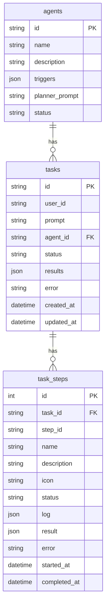

# Demand-OS: Directus 后端字段与数据模型设计

**版本**: 1.0  
**日期**: 2026-02-07  
**作者**: Manus AI  
**目标**: 为 Demand-OS 的 Agent 模式设计完整的 Directus 后端数据模型，支持任务管理、执行日志和结果存储。

---

## 1. 核心数据模型

我们将创建三个核心的 Collection 来支持 Agent 的完整生命周期：

1.  **`agents`**: 存储所有可用的 Agent 模板。
2.  **`tasks`**: 记录每个由用户发起的任务。
3.  **`task_steps`**: 记录每个任务的执行步骤和结果。

### 1.1 `agents` Collection

**用途**: 定义所有可用的 Agent 模板，方便在后台管理和扩展。

| 字段名 | 类型 | 描述 | 示例 |
| :--- | :--- | :--- | :--- |
| `id` | String (Primary Key) | Agent 的唯一标识 | `factory-odm-agent` |
| `name` | String | Agent 的名称 | `工厂委托开发助手` |
| `description` | Text | Agent 的详细描述 | `评估产品生产产能需求，匹配合适的工厂...` |
| `triggers` | Tags | 触发关键词 | `工厂`, `委托开发`, `产能` |
| `planner_prompt` | Text (Markdown) | 用于生成执行计划的 LLM Prompt | `你是一个任务规划助手...` |
| `status` | String (Dropdown) | Agent 状态 | `published`, `draft`, `archived` |

### 1.2 `tasks` Collection

**用途**: 记录每个由用户发起的任务，作为任务的顶层容器。

| 字段名 | 类型 | 描述 | 示例 |
| :--- | :--- | :--- | :--- |
| `id` | UUID (Primary Key) | 任务的唯一标识 | `a1b2c3d4-e5f6-g7h8-i9j0-k1l2m3n4o5p6` |
| `user_id` | String | 发起任务的用户 ID | `user-abc-123` |
| `prompt` | Text | 用户的原始输入 | `帮我评估这个产品的生产产能需求...` |
| `agent` | Many-to-One (`agents`) | 关联的 Agent | `factory-odm-agent` |
| `status` | String (Dropdown) | 任务的整体状态 | `pending`, `running`, `completed`, `failed` |
| `results` | JSON | 任务的最终聚合结果 | `{ "proposal": { ... }, "factories": [ ... ] }` |
| `error` | String | 任务失败时的错误信息 | `API call failed` |
| `created_at` | Datetime | 创建时间 | `2026-02-07 20:00:00` |
| `updated_at` | Datetime | 更新时间 | `2026-02-07 20:05:00` |

### 1.3 `task_steps` Collection

**用途**: 记录每个任务的详细执行步骤，包括状态、日志和结果。

| 字段名 | 类型 | 描述 | 示例 |
| :--- | :--- | :--- | :--- |
| `id` | BigInt (Primary Key) | 步骤的唯一标识 | `1001` |
| `task` | Many-to-One (`tasks`) | 关联的任务 | `a1b2c3d4-...` |
| `step_id` | String | 步骤的内部 ID | `step1_analyze_specs` |
| `name` | String | 步骤的名称 | `产品规格分析` |
| `description` | String | 步骤的描述 | `分析产品的技术规格和复杂度` |
| `icon` | String | 步骤的图标 | `📦` |
| `status` | String (Dropdown) | 步骤的执行状态 | `pending`, `running`, `completed`, `failed` |
| `log` | JSON | 步骤的执行日志 | `["开始分析...", "分析完成"]` |
| `result` | JSON | 步骤的执行结果 | `{ "complexity": "高", "materials": ["铝合金"] }` |
| `error` | String | 步骤失败时的错误信息 | `Invalid product description` |
| `started_at` | Datetime | 开始时间 | `2026-02-07 20:01:00` |
| `completed_at` | Datetime | 完成时间 | `2026-02-07 20:02:00` |

---

## 2. 关系图

---

## 3. API 交互流程

1.  **`POST /api/agent/start`**
    - 在 `tasks` Collection 中创建一条新记录，`status` 为 `pending`。
    - 根据 `agent.planner_prompt` 和 `task.prompt` 调用 LLM 生成执行计划。
    - 批量在 `task_steps` Collection 中创建所有步骤的记录，`status` 为 `pending`。
    - 返回 `taskId` 和 `plan`。

2.  **`TaskExecutor` (异步执行)**
    - 遍历 `task_steps`，按顺序执行。
    - 每一步开始时，更新 `task_steps` 中对应记录的 `status` 为 `running`，并通过 WebSocket 推送。
    - 每一步完成时，更新 `status` 为 `completed`，并将结果写入 `result` 字段，通过 WebSocket 推送。

3.  **前端 UI**
    - 通过 `taskId` 获取 `task` 和关联的 `task_steps`。
    - 监听 WebSocket，实时更新 `task_steps` 的状态和结果。

---

## 4. 总结

这个数据模型为 Demand-OS 的 Agent 模式提供了坚实的基础，支持：

- **可扩展的 Agent 管理**: 可以随时在 Directus 中添加或修改 Agent。
- **完整的任务生命周期追踪**: 从任务创建到每一步的执行，都有详细的记录。
- **结构化的结果存储**: 每个步骤的结果都以 JSON 格式存储，方便前端渲染。

这个设计将使我们能够构建一个真正对标 Accio 的、健壮且可维护的对话式执行引擎。
